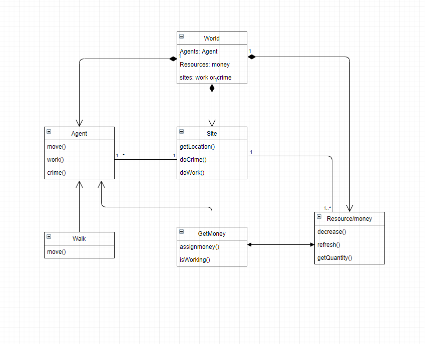

# School of Computing &mdash; Year 4 Project Proposal Form

> Edit (then commit and push) this document to complete your proposal form.
> Make use of figures / diagrams where appropriate.
>
> Do not rename this file.

## SECTION A

|                     |                   |
|---------------------|-------------------|
|Project Title:       | Agent Based Simulation to Observe the Effect of Inequality on Crime            |
|Student 1 Name:      | Oishin Smith      |
|Student 1 ID:        | 16401096          |
|Student 2 Name:      | Aaron Edgeworth   |
|Student 2 ID:        | 13493068          |
|Project Supervisor:  | Renaat Verbruggen |

> Ensure that the Supervisor formally agrees to supervise your project; this is only recognised once the
> Supervisor assigns herself/himself via the project Dashboard.
>
> Project proposals without an assigned
> Supervisor will not be accepted for presentation to the Approval Panel.

## SECTION B

> Guidance: This document is expected to be approximately 3 pages in length, but it can exceed this page limit.
> It is also permissible to carry forward content from this proposal to your later documents (e.g. functional
> specification) as appropriate.
>
> Your proposal must include *at least* the following sections.

### Introduction

> Describe the general area covered by the project.

Agent Based Modelling

For our project, we decided upon the idea of modeling a system to attempt to test and observe the link between inequality in a society and crime. Since the 1970s there 
has been studies and analyses that posit a link between the levels of economic inequality and the prevalence of crime, particularly violent crime. In 1974, Nobel Prize 
winner Gary Becker published a paper titled "Crime and Punishment: An Economic Approach". Continuing research appears to further this argument. Many economists assert 
that although global wealth is increasing, wealth and societal inequality has continued to rise. This is an important topic of discussion in our day and age. For our 
project we decided to use modern computing techniques to attempt to help test the theory that as the inequality in a society rises, so too does the level of criminal
activity in that society. We decided to create a simulation that allows us to recreate and modify the contributing factors of a society that make it unequal. Some of 
these include: wealth, income, status, living conditions and relative happiness of the population of the society. Agent Based Modeling is a technique that is applicable 
in many areas for simulating and observing emergent behavior among certain groups of individuals. This is an ideal model for testing our environment to help validate 
the theories outlined in many of the papers published. We will test our simulations against contemporary, real world studies about the crime and inequality rates in 
countries as they have developed and hope to gain some insight into the mechanisms that create the emergent behavior of crime.

### Outline

> Outline the proposed project.

Agent Based Simulation to Observe the Effect of Inequality on Crime.

Our project idea will be centered around an Agent Based Modelling (ABM) simulation. We are going to design an Agent Based Model that simulates the actions and interactions
of autonomous agents that participate and function within a controlled environment. The simulated community will attempt to provide the necessary conditions for the 
emergence of certain behaviors, specifically criminal behavior, in the environment. As is typical in an ABM, the agents will be autonomous, basic representations of 
humans living in a society. These agents will participate in the society independently, setting their own objectives and activities based on what they deem to be in their
best interest. As is also required in ABMs, the environment and conditions thereof will factor into the agents ability to make decisions. We will have the ability to modify 
the environment to attempt to simulate the conditions of existing societies, observing if the model will validate or contradict the crime and inequality statistic of these
countries.

The system will also include a suite of graphical and statistical feedback that will allow the users to observe in real time the performance of each simulation of the society.
Each simulation will start off from a user determined condition and as it runs and the autonomous agents interact the emergence of particular behaviors will become 
observable.

An example of this would be a society that begins with a relatively equal society. The wealth, income and status of the individual agents will be relatively the same. But as 
resources become limited and the agents begin to compete against one another for a finite set of resources, we would expect to see a disparity develop. As the inequality 
grows, some of the agents will deem it to be in their best interest to resort to stealing resources from one another to attempt to maintain acceptable living conditions. 
This would hopefully mirror and validate studies that posit a link between criminal activity and a widening status gap. 

For the project we will be implementing a Kanban scheduling system to divide the work and provide a clear overview of the progression of our work, if we are experiencing any 
blockers and what tasks have priority over others. We will belikely be using a website like Trello for this purpose.

the image below is a possible class diagram that may be used in the future.

  

### Background

> Where did the ideas come from?

We believe simulation and AI development to be an interesting area of study. In recent years we have seen growing discontent with both a perceived and observable growth in 
economic inequality. Movements like the Yellow Vest Protests in 2018 show that inequality is a topic that is of growing importance in contemporary society. Similarly, studies
done by the United Nations Economic Commission for Latin America and the Caribbean show that income inequality in Brazil has risen to extreme levels. Studies link a potential
correlation between this and the rising level of violent crime in the country. A mutual interest in global and economic issue led us to the decision to create a project that 
hopefully provide so use to academic users of the system in the future.

### Achievements

> What functions will the project provide? Who will the users be?

*  The project will provide a simulation
*  the system will have user determined input fields for the variables such as the number of agents, the amount of resources etc. 
*  Agents will be autonomous, able to determine what is in their best interest and interact with it's environment 
*  The User Interface will be designed thoroughly to display graphical and statistical reports
*  Users can observe in real time the performance of each simulation of the society.

The users will mainly be the Developers and Academics conducting research in areas like Sociology, Economics and Psychology.

### Justification

> Why/when/where/how will it be useful?

Agent Based modelling are a mini model that simulate interactions of many agents to recreate and predict real life situations and problems. ABM's are being used in many
fields of study and work environments nowadays such as Social Science, Economics and Banks. we are doing research in the effects of inequality on crime and Agent Based 
Modelling should help with that. After the simulation has run, we can get results that can be compared with real life online results that could potentially be used to predict 
future crime rate. ABMs are extremely powerful tools to study emergent behavior. This is ideal for our project wherein we wish to observe as a society becomes increasingly 
unequal, will criminal behavior emerge. Agent Based Models are extremely useful in a wide range of fields. We believe that our project will not only be useful for the specific 
area we have decided to study, but having familiarity and understanding of such a system will be extremely useful for the progression of our careers and education. For our 
project, it has the potential to be highly useful for students and academics that are involved in Economics and Social sciences.
### Programming language(s)

> List the proposed language(s) to be used.

Java, Markdown language (HTML)

### Programming tools / Tech stack

> Describe the compiler, database, web server, etc., and any other software tools you plan to use.

Java swing for the GUI. Eclipse IDE for Java. 
Mason toolkit for ABM modelling,
Junit, gitlab, git commands and console.

### Hardware

> Describe any non-standard hardware components which will be required.

### Learning Challenges

> List the main new things (technologies, languages, tools, etc) that you will have to learn.

As Agent based modelling is mostly new to us, we're going to have to do some extensive research about the topic. We have to understand terminology, the whole ABM concept and then
look into possible software or frameworks that could help us such as MASON. It will also be important to understand what the exact purpose of the model is and how we will 
verify it. 

We will also have to revise some Java and look into MASON and Swing. Looking into the different statistical algorithms for the graphing part of our system will be necessary. 
And looking into possible frameworks and API's that could help us with the UI part of the application will be important.

As a research project with potential application for academic research, we will need to be methodical in our approach to how we document and reference important aspects of our 
research. Currently there is evidence to suggest a correlation between inequality and criminal activity in a society and we will need to appropriately reference the material 
that we use in the crafting of our simulation.

### Breakdown of work

> Clearly identify who will undertake which parts of the project.
>
> It must be clear from the explanation of this breakdown of work both that each student is responsible for
> separate, clearly-defined tasks, and that those responsibilities substantially cover all of the work required
> for the project.

As ABM is a huge topic and can get very complicated, our first goal will be to have a working but simple prototype done within the next couple of months that will include. 
a UI and basic functionality. We're both going to work on the front end and back end of the application. For the most part the work will be divided equally, but Aaron will 
have more of a focus on the back end programming for the product and Oishin will engage more so with the front end, but we both expect to be working on both areas to some 
degree. Aaron has some minor experience with the MASON Java Toolkit and will be working with that initially while Oishin will conduct research, gathering references and 
studies that are applicable to our project. Graphical feedback is going to be an extremely important feature of the simulation, and initially Oishin will be working to 
develop this. As the project progresses and we encounter issues or unforeseen problems we expect to come together and contribute equally in both areas to overcome any issues
encountered.

#### Student 1

> *Student 1 should complete this section.*

When working on the UI, I'll mainly be working on the graphical part of the application. The UI will be giving each user constant feedback with graphs and statistics. I'll
also be focusing on displaying the different UI elements in the appropriate locations.

I will also be working on the UML parts with Aaron and the Functional Specification in the next couple of weeks as it will be very important to understand our ABM project more
thoroughly. 

On the back-end side I'll be working with several functions involving the statistical side of the system and I will also look into displaying the graphs in a good way. There will
also be a combined work effort in coming up with good ABM algorithms for our system. Algorithms such as the different interactions between the agents, the interactions
that the agents will have within their environment and how the environment will affect resources, sites and the agents.

#### Student 2

> *Student 2 should complete this section.*

When beginning the project, I will be mainly involved with the configuration and setup of the MASON toolkit and developing the back-end basics to set up and run a prototype version 
of our model. Mapping out and coding the basic behavioral algorithms that the agents will function through. Likewise, setting up the environment for these agents to exist in will 
also be an area that I will be involved in initially until we have a working base version of the model. As the project progresses we will come together to tune and develop the 
model as the complexity increases.

When coding out the basic behavioral algorithms I will need to base these on factors that have been shown to effect the inequality in a society and the reasoning behind why some 
individuals may resort to criminal behavior. This means that I will need to be researching to find applicable journals and studies that have been published and peer reviewed by 
academics, so as not to be basing the behaviors on speculative reasoning behind the emergence of criminal behavior.

